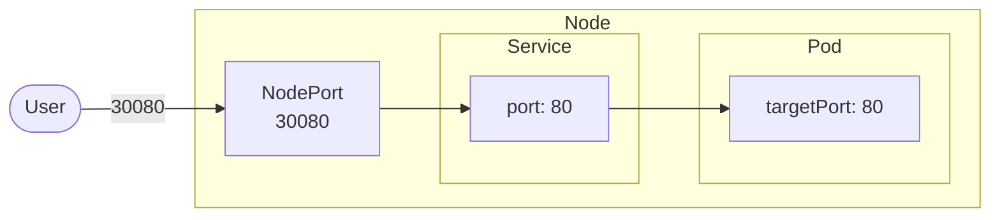

What it does?
It helps connects apps to other apps or users e.g. connect users with front-end with back-end and to the database.
this helps lose coupling between microservices 

## Service Types
**Node port:** It makes a pod accessible on a port in the node
**Cluster IP:** service creates a virtual IP (vip) inside the cluster to enable the communication between services e.g. set of frontend to set of backend
**Load balancer:** Creates a load balancer to distribute load across services

### NodePort
- The range of ports is (30000 - 32767)
```yaml
apiVersion: v1

kind: Service 

metadata:
  name: app-service

spec:
  type: NodePort
  ports:
    - targetPort: 80
      port: 80
      nodePort: 30080
```


