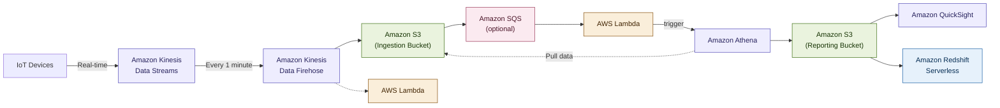

# Analytics & Data Services

> For foundational analytics concepts, see [[100 - Cloud/AWS/Cloud Practitioner/Analytics|Cloud Practitioner: Analytics]].

---

## AWS Glue

Fully managed, serverless ETL (extract, transform, load) service. Creates, runs, and monitors ETL jobs in a few clicks.

> [!note] Covered at awareness level in [[100 - Cloud/AWS/Cloud Practitioner/Analytics#AWS Glue|Cloud Practitioner: Glue]]. This section adds SAA-depth details.

### Key Features

- **Managed ETL**: prepare and transform data for analytics
- **Fully serverless**: no infrastructure to manage
- **Glue Data Catalog**: centralized metadata repository, used by Athena, Redshift Spectrum, EMR
- **Glue Job Bookmarks**: prevent re-processing of old data across incremental ETL runs
- **Glue DataBrew**: clean and normalize data using pre-built transformations (no-code)
- **Glue Studio**: GUI to create, run, and monitor ETL jobs visually
- **Glue Streaming ETL**: built on Apache Spark Structured Streaming, compatible with Kinesis Data Streams, Kafka, and MSK

### Use Cases

- Data cataloging and discovery
- ETL pipelines for data warehouses and data lakes
- Schema evolution and data quality checks
- Streaming data transformation

---

## AWS Lake Formation

Fully managed service that makes it easy to set up a secure data lake in days. Built on top of AWS Glue.

### Key Features

- **Centralized data lake**: stores data in one central S3 location, combining structured and unstructured data
- **Automated setup**: automates collecting, cleansing, moving, cataloging, and de-duplicating data (using ML Transforms)
- **Out-of-the-box source blueprints**: S3, RDS, relational and NoSQL databases
- **Fine-grained access control**: row-level and column-level security for applications
- **Centralized permissions**: manage data access in one place across all analytics services
- **Built on AWS Glue**: uses Glue Data Catalog and ETL capabilities under the hood

### Use Cases

- Building a governed data lake for analytics
- Consolidating data from multiple sources into S3
- Enabling self-service analytics with governed access

---

## Amazon Managed Service for Apache Flink

Previously named Kinesis Data Analytics for Apache Flink. Managed service to run Apache Flink applications for stream processing.

### Key Features

- **Stream processing framework**: Flink (Java, Scala, or SQL) processes data streams in real time
- **Managed cluster**: AWS provisions compute resources, handles parallel computation and automatic scaling
- **Application backups**: implemented as checkpoints and snapshots
- **Full Flink feature support**: use any Apache Flink programming features to transform data
- **Important**: Flink does **not** read from Amazon Data Firehose

### Use Cases

- Real-time stream processing and transformation
- Complex event processing
- Real-time analytics on streaming data

---

## Amazon MSK (Managed Streaming for Apache Kafka)

Fully managed Apache Kafka on AWS. Alternative to Amazon Kinesis for streaming workloads.

### Key Features

- **Managed Kafka**: MSK creates and manages Kafka broker nodes and Zookeeper nodes
- **VPC deployment**: deploy in your VPC, multi-AZ (up to 3 for HA)
- **Automatic recovery**: from common Apache Kafka failures
- **Data storage**: stored on EBS volumes for as long as you want
- **MSK Serverless**: run Kafka without managing capacity; MSK auto-provisions and scales compute and storage

### Kinesis Data Streams vs Amazon MSK

| Kinesis Data Streams | Amazon MSK |
|---------------------|------------|
| 1 MB message size limit | 1 MB default, configurable higher (e.g. 10 MB) |
| Data Streams with Shards | Kafka Topics with Partitions |
| Shard Splitting & Merging | Can only add partitions to a topic |
| KMS at-rest encryption | KMS at-rest encryption |
| TLS in-flight encryption | PLAINTEXT or TLS in-flight encryption |

### Consumers

Both Kinesis Data Streams and MSK can be consumed by:
- Kinesis Data Analytics for Apache Flink
- AWS Glue Streaming ETL Jobs (Apache Spark Streaming)
- Lambda
- Applications running on EC2, ECS, EKS

### Streaming S3 Data into Kinesis with AWS DMS

AWS DMS can bridge existing S3 data (including ongoing updates) into Kinesis Data Streams without writing custom code. Useful for backfilling historical data + CDC into a real-time pipeline.

**How it works:**
- Source: **Amazon S3**
- Target: **Amazon Kinesis Data Streams** (also supports MSK)
- DMS performs **full load + CDC** (change data capture) from S3 files to the stream
- A **DMS replication instance** handles the data movement and can scale up/down

**Why DMS over Lambda/EventBridge:**
- No custom code to write or maintain — fully configured via DMS console
- DMS handles both existing data (backfill) and new/changed files
- Lambda/EventBridge paths require significant custom development and only handle new events, not existing data

**Consumers** of the Kinesis stream can then process data in real time (Lambda, Kinesis Data Firehose, Kinesis Data Analytics, KCL).

> [!tip] Exam Tip
> If the requirement is to stream **existing** S3 data + ongoing file updates into Kinesis **without custom code**, choose **AWS DMS**. Lambda/EventBridge handles new events only and needs custom development.

---

## Amazon Athena

**Serverless** query service to analyze data stored in Amazon S3. Uses standard SQL language to query the files (built on Presto).

**Supported formats:** CSV, JSON, ORC, Avro, and Parquet

**Pricing:** $5.00 per TB of data scanned

**Use cases:**
- Business intelligence / analytics / reporting
- Analyze & query VPC Flow Logs, ELB Logs, CloudTrail trails
- Commonly used with Amazon QuickSight for reporting/dashboards

> [!tip] Exam Tip
> Analyze data in S3 using serverless SQL → use Athena

### Performance Improvement

- Use **columnar data** for cost-savings (less scan): Apache Parquet or ORC recommended
- Use Glue to convert your data to Parquet or ORC
- **Compress data** for smaller retrievals (bzip2, gzip, lz4, snappy, zlib, zstd)
- **Partition datasets** in S3 for easy querying on virtual columns:
  ```
  s3://yourBucket/pathToTable
  /<PARTITION_COLUMN_NAME>=<VALUE>
  /<PARTITION_COLUMN_NAME>=<VALUE>
  /<PARTITION_COLUMN_NAME>=<VALUE>
  ```
  Example: `s3://athena-examples/flight/parquet/year=1991/month=1/day=1/`
- Use **larger files** (> 128 MB) to minimize overhead

### Federated Query

Allows you to run SQL queries across data stored in relational, non-relational, object, and custom data sources (AWS or on-premises).

- Uses **Data Source Connectors** that run on AWS Lambda to run Federated Queries (e.g., CloudWatch Logs, DynamoDB, RDS)
- Store the results back in Amazon S3

---

## Amazon Redshift

Amazon Redshift is built on cloud economics that scale with your usage, powering modern analytics and autonomous agentic AI workloads on your data warehouse. Redshift delivers up to 2.2x better price-performance and 7x better throughput than other cloud data warehouses.

**Key characteristics:**
- Based on PostgreSQL, but **not used for OLTP**
- It's **OLAP** (online analytical processing, analytics and data warehousing)
- 10x better performance than other data warehouses, scale to PBs of data
- **Columnar storage** of data (instead of row-based) & parallel query engine
- Two modes: **Provisioned cluster** or **Serverless cluster**
- Has a SQL interface for performing the queries
- BI tools such as Amazon QuickSight or Tableau integrate with it
- **vs Athena:** faster queries / joins / aggregations thanks to indexes

### Redshift Architecture

- **Leader node:** query planning, results aggregation
- **Compute node:** performing the queries, send results to leader
- **Provisioned mode:** choose instance types in advance, can reserve instances for cost savings

### Redshift Spectrum

Efficiently query and retrieve structured and semi-structured data from files in Amazon S3 **without loading the data into Redshift tables**.

- **Must have a Redshift cluster available** to start the query (unlike Athena which is fully serverless)
- The query is submitted to thousands of Redshift Spectrum nodes for massive parallelism
- Much of the processing occurs in the Redshift Spectrum layer
- Most data remains in Amazon S3
- Multiple clusters can concurrently query the same dataset in S3 without copies

### Loading Data into Redshift

Large inserts are MUCH better than many small ones.

**Three main approaches:**

| Method | How it works | Best for |
|--------|-------------|----------|
| **Amazon Kinesis Data Firehose** | Streams data into Redshift through S3 (COPY command) | Real-time / streaming data |
| **S3 using COPY command** | Load directly from S3 bucket into Redshift | Large batch loads |
| **EC2 Instance (JDBC driver)** | Write data in batches from an EC2 instance | Application-driven loads |

**COPY command example:**
```sql
copy customer
from 's3://mybucket/mydata'
iam_role 'arn:aws:iam::0123456789012:role/MyRedshiftRole';
```

- S3 COPY can go through the Internet (without Enhanced VPC Routing) or through VPC (with Enhanced VPC Routing)
- For JDBC, it is better to write data in batches

### Backup & Recovery

- Redshift has **Multi-AZ** mode for some clusters
- **Snapshots** are point-in-time backups of a cluster, stored internally in S3
- Snapshots are **incremental** (only what has changed is saved)
- You can restore a snapshot into a new cluster
- **Automated:** every 8 hours, every 5 GB, or on a schedule. Set retention between 1 to 35 days
- **Manual:** snapshot is retained until you delete it
- You can configure Amazon Redshift to automatically copy snapshots (automated or manual) of a cluster to another AWS Region

---

## Amazon OpenSearch

Amazon OpenSearch is the successor to Amazon ElasticSearch.

**Key characteristics:**
- In DynamoDB, queries only exist by primary key or indexes
- With OpenSearch, you can **search any field**, even partial matches
- Common to use OpenSearch as a **complement to another database**
- Two modes: **managed cluster** or **serverless cluster**
- Does not natively support SQL (can be enabled via a plugin)
- **Ingestion** from Kinesis Data Firehose, AWS IoT, and CloudWatch Logs
- **Security** through Cognito & IAM, KMS encryption, TLS
- Comes with **OpenSearch Dashboards** (visualization)

> [!tip] Exam Tip
> Centralized log storage + real-time search/analysis + threat detection dashboards → **Amazon OpenSearch Service**. Distinguishes it from CloudWatch Logs (storage/basic queries only) or S3 + Athena (batch analysis, not real-time).
>
> **Typical architecture:** App/web logs → CloudWatch Logs or agents → Kinesis Data Firehose (optional buffering/transformation) → OpenSearch (storage + indexing) → OpenSearch Dashboards (search, visualization, alerting).
>
> **Complementary services:** AWS WAF + Shield (threat blocking), CloudWatch Logs Insights (ad hoc queries), Amazon Security Lake (centralized security data lake), GuardDuty (managed threat detection, feeds findings into OpenSearch).

---

## Amazon EMR

**EMR** stands for "Elastic MapReduce". Helps creating Hadoop clusters (Big Data) to analyze and process vast amounts of data.

**Key characteristics:**
- Clusters can be made of hundreds of EC2 instances
- Comes bundled with **Apache Spark, HBase, Presto, Flink**
- Takes care of all the provisioning and configuration
- **Auto-scaling** and integrated with Spot instances
- **Use cases:** data processing, machine learning, web indexing, big data

### Node Types

- **Master Node:** manage the cluster, coordinate, manage health (long-running)
- **Core Node:** run tasks and store data (long-running)
- **Task Node** (optional): just to run tasks (usually Spot)

### Purchasing Options

- **On-demand:** reliable, predictable, won't be terminated
- **Reserved** (min 1 year): cost savings (EMR will automatically use if available)
- **Spot Instances:** cheaper, can be terminated, less reliable

Can have **long-running cluster** or **transient** (temporary) cluster.

---

## Amazon QuickSight

**Serverless** machine learning-powered business intelligence service to create interactive dashboards.

**Key characteristics:**
- Fast, automatically scalable, embeddable, with **per-session pricing**
- **Use cases:** business analytics, building visualizations, ad-hoc analysis, business insights
- **Integrated** with RDS, Aurora, Athena, Redshift, S3
- **In-memory computation** using SPICE engine if data is imported into QuickSight
- **Enterprise edition:** possibility to setup Column-Level security (CLS)

### Dashboard & Analysis

- Define **Users** (standard versions) and **Groups** (enterprise version)
- These users & groups only exist within QuickSight, not IAM
- A **dashboard:**
  - Is a **read-only snapshot** of an analysis that you can share
  - Preserves the configuration of the analysis (filtering, parameters, controls, sort)
  - You can share the analysis or the dashboard with Users or Groups
  - To share a dashboard, you must first **publish** it
  - Users who see the dashboard can also see the underlying data

---

## Big Data Ingestion Pipeline (Reference Architecture)

Fully serverless pipeline for real-time data collection, transformation, SQL querying, and dashboards.



**Pipeline flow:**

1. **IoT Core** harvests data from IoT devices
2. **Kinesis Data Streams** for real-time data collection
3. **Kinesis Data Firehose** delivers data to S3 in near real-time (~1 minute); Lambda can transform data in-flight
4. **Amazon S3** (ingestion bucket) stores raw data; can trigger SQS notifications
5. **Lambda** subscribes to SQS (alternative: connect S3 directly to Lambda)
6. **Athena** runs serverless SQL queries on S3 data; results stored back in S3
7. **Reporting bucket** contains analyzed data, consumed by **QuickSight** (dashboards) or **Redshift Serverless** (data warehouse)

---

← [[100 - Cloud/AWS/Solutions Architect Associate/README|Solutions Architect Associate]]
