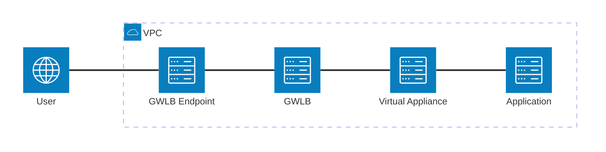
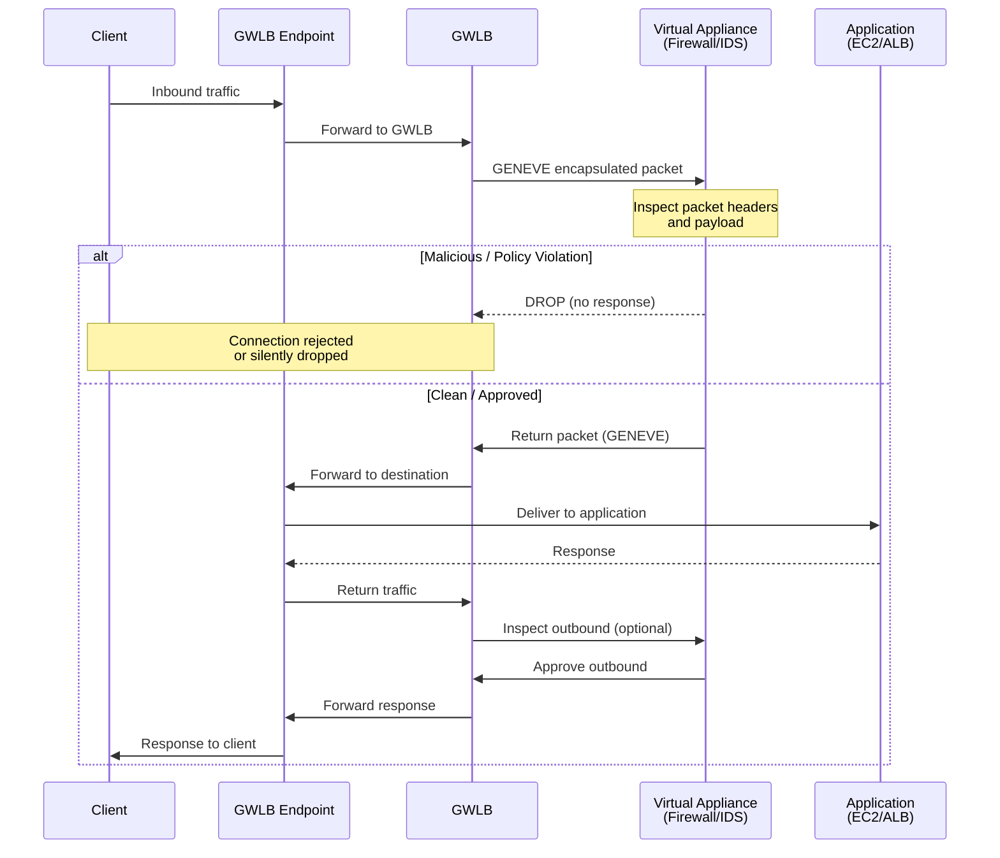

# Elastic Load Balancer (ELB)

Managed load balancing service by AWS. Distributes incoming application traffic across multiple targets (EC2 instances, containers, Lambda functions, IP addresses).

**Why use ELB:**
- Spread load across multiple servers/instances
- Expose a single point of access to the application
- Handle server failures automatically
- SSL/TLS termination
- Health checks for targets
- Enforce stickiness with cookies
- High availability across AZs
- Separate public and private traffic

Cheaper than managing your own load balancer. Integrates with Route 53, WAF, Global Accelerator, and other AWS services.

Load balancers can be **internet-facing** (public) or **internal** (private).

## LB Types Comparison

| Type | Year | Layer | Protocols | Use Case |
|------|------|-------|-----------|----------|
| **Classic LB** (deprecated) | 2009 | 4/7 | HTTP/S, TCP, SSL | Legacy applications |
| **Application LB (ALB)** | 2016 | 7 | HTTP/S, WebSockets | Web apps, microservices, containers |
| **Network LB (NLB)** | 2017 | 4 | TCP, UDP, TLS | High performance, low latency, TCP/UDP |
| **Gateway LB (GWLB)** | 2020 | 3 | IP (GENEVE) | Third-party network appliances |

## Application Load Balancer (ALB)

Layer 7 (HTTP/HTTPS). Routes traffic based on content of the request.

**Features:**
- Routes to multiple apps on same machine (containers)
- Supports HTTP/2 and WebSockets
- HTTP to HTTPS redirection
- Path-based and host-based routing
- Good fit for microservices and container architectures

### Routing Methods

| Method | Example | Description |
|--------|---------|-------------|
| **Path-based** | `/users`, `/api/v1` | Route based on URL path |
| **Host-based** | `api.example.com`, `web.example.com` | Route based on hostname |
| **Query string** | `?env=prod` | Route based on query parameters |
| **HTTP headers** | `X-Custom-Header: value` | Route based on header values |
| **HTTP method** | `GET`, `POST` | Route based on HTTP method |
| **Source IP** | `192.168.0.0/16` | Route based on client IP |

### Target Groups

| Target Type | Protocol | Notes |
|-------------|----------|-------|
| EC2 instances | HTTP/HTTPS | Can be managed by Auto Scaling Group |
| ECS tasks | HTTP/HTTPS | Managed by ECS service |
| Lambda functions | HTTP/HTTPS | Request translated into JSON event |
| IP Addresses | HTTP/HTTPS | Must be private IPs (VPC peering, Direct Connect) |
| ALB | HTTP/HTTPS | ALB as target for another ALB (chaining) |

**Key points:**
- ALB can route to **multiple target groups** simultaneously
- Health checks are configured at the **target group level**
- ALB has a **fixed DNS hostname** (not a static IP)
- Preserves client info via headers: `X-Forwarded-For` (client IP), `X-Forwarded-Port`, `X-Forwarded-Proto`

### Sticky Sessions (Session Affinity)

Routes requests from the same client to the same target. Uses cookies:

**Duration-based Cookies:**
- Generated by the load balancer
- Cookie name is `AWSALB` for ALB, `AWSELB` for CLB
- You set a fixed duration (e.g., 1 hour), the LB creates the cookie and it expires after that time
- Simple approach, no application involvement required

**Application-based Cookies:**
- **Custom cookie**: generated by your application (e.g., a session ID), can include any custom attributes. Cookie name must be specified individually for each target group. Don't use `AWSALB`, `AWSALBAPP`, or `AWSALBTG` (reserved by ELB). Gives you full control over cookie content and lifetime
- **Application cookie** (`AWSALBAPP`): generated by the load balancer but tied to the application's session lifecycle rather than a fixed timer. The LB tracks when the app considers the session over

**Key difference**: duration-based uses a fixed timer you configure. Application-based is tied to your app's actual session logic, either via your own cookie or the LB tracking app state

### Connection Draining (Deregistration Delay)

When a target is deregistered, ALB waits for in-flight requests to complete (default 300s, configurable 0-3600s).

## Network Load Balancer (NLB)

Layer 4 (TCP/UDP/TLS). For extreme performance and low latency.

**Features:**
- Handles millions of requests per second
- Ultra-low latency (single-digit milliseconds)
- Static IP addresses (one per AZ)
- Supports Elastic IP assignment
- Preserves source IP (no SNAT by default)
- TLS termination at the load balancer
- Health checks at the target level

**Use cases:**
- TCP/UDP traffic (gaming, IoT, financial apps)
- Applications requiring static IPs
- High-performance, low-latency workloads
- Preserving client source IP

**Target types:** EC2 instances, IP addresses, ALB (for TLS termination + Layer 7 routing)

## Gateway Load Balancer (GWLB)

Layer 3. Deploys, scales, and manages third-party virtual appliances (firewalls, IDS/IPS, DPI).

**Features:**
- Uses **GENEVE** encapsulation protocol (port 6081)
- Distributes traffic to virtual appliances
- Scales appliances horizontally
- Combines transparent network gateway and load balancer

**Architecture:**
- **GWLB Endpoint (GWLBe)**: VPC endpoint for traffic entry/exit
- **Target Group**: virtual appliances, target types limited to EC2 instances and private IP addresses

**Traffic Flow (Overview):**

**Traffic Flow (Detailed):**

**Use cases:**
- Centralized network security (firewalls, intrusion detection)
- Traffic inspection and filtering
- Compliance and auditing

---

← [[100 - Cloud/AWS/Solutions Architect Associate/README|Solutions Architect Associate]]
