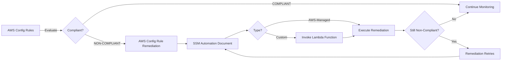

# AWS Monitoring: CloudWatch, CloudTrail & Config

> For foundational concepts, see [[100 - Cloud/AWS/Cloud Practitioner/Monitoring#Amazon CloudWatch|Cloud Practitioner: CloudWatch]], [[100 - Cloud/AWS/Cloud Practitioner/Monitoring#AWS CloudTrail|Cloud Practitioner: CloudTrail]], and [[100 - Cloud/AWS/Cloud Practitioner/Governance#AWS Config|Cloud Practitioner: Config]].

---

## Amazon CloudWatch

### CloudWatch Metrics

CloudWatch provides metrics for every service in AWS. A metric is a variable to monitor (CPUUtilization, NetworkIn, etc.).

#### Key Concepts

- **Namespaces**: metrics belong to namespaces (e.g., AWS/EC2, AWS/S3)
- **Dimensions**: attributes of a metric (instance id, environment, etc.). Up to 30 dimensions per metric
- **Timestamps**: metrics have timestamps
- **Detailed monitoring**: if enabled, you get data every 1 min instead of every 5 min
- **Custom metrics**: can create CloudWatch Custom Metrics (e.g., for RAM usage)
- **Dashboards**: can create CloudWatch dashboards of metrics

#### CloudWatch Metric Streams

Continually stream CloudWatch metrics to a destination with near-real-time delivery and low latency.

**Destinations:**
- Amazon Kinesis Data Firehose (and then its destinations)
- 3rd party service providers: Datadog, Dynatrace, New Relic, Splunk, Sumo Logic

**Filtering**: option to filter metrics to only stream a subset of them

### CloudWatch Logs

#### Log Structure

- **Log groups**: arbitrary name, usually representing an application
- **Log streams**: instances within application / log files / containers
- **Expiration policies**: can define retention (never expire, 1 day to 10 years)

#### Log Destinations

CloudWatch Logs can send logs to:
- Amazon S3 (exports)
- Kinesis Data Streams
- Kinesis Data Firehose
- AWS Lambda
- OpenSearch

> [!note] Logs are encrypted by default. Can setup KMS-based encryption with your own keys.

#### Log Sources

- SDK, CloudWatch Logs Agent, CloudWatch Unified Agent
- Elastic Beanstalk: collection of logs from application
- ECS: collection from containers
- AWS Lambda: collection from function logs
- VPC Flow Logs: VPC specific logs
- API Gateway
- CloudTrail based on filter
- Route 53: Log DNS queries

#### CloudWatch Logs Insights

Search and analyze log data stored in CloudWatch Logs.

**Capabilities:**
- Purpose-built query language
- Automatically discovers fields from AWS services and JSON log events
- Fetch desired event fields, filter based on conditions
- Calculate aggregate statistics, sort events, limit number of events
- Can save queries and add them to CloudWatch Dashboards
- Can query multiple Log Groups in different AWS accounts

> [!tip] Exam Tip
> Logs Insights is a query engine, not a real-time engine. Use it for historical analysis and troubleshooting.

#### CloudWatch Logs S3 Export

- Log data can take up to 12 hours to become available for export
- The API call is 
- Not near-real time or real-time; use Logs Subscriptions instead

#### CloudWatch Logs Subscriptions

Get real-time log events from CloudWatch Logs for processing and analysis.

**Destinations:**
- Kinesis Data Streams
- Kinesis Data Firehose
- Lambda

**Subscription Filter**: filter which log events are delivered to your destination

**Cross-Account Subscription**: send log events to resources in a different AWS account (KDS, KDF)

#### CloudWatch Logs for EC2

> [!warning] Important
> By default, no logs from your EC2 machine will go to CloudWatch. You need to run a CloudWatch agent on EC2 to push the log files you want.

**Requirements:**
- Make sure IAM permissions are correct
- The CloudWatch log agent can be setup on-premises too

#### CloudWatch Logs Agent & Unified Agent

For virtual servers (EC2 instances, on-premises servers).

| Agent | Capabilities |
|-------|-------------|
| **CloudWatch Logs Agent** | Old version. Can only send to CloudWatch Logs |
| **CloudWatch Unified Agent** | Collect additional system-level metrics (RAM, processes, etc.). Collect logs to send to CloudWatch Logs. Centralized configuration using SSM Parameter Store |

#### CloudWatch Unified Agent Metrics

Collected directly on your Linux server / EC2 instance:

- **CPU**: active, guest, idle, system, user, steal
- **Disk**: free, used, total; Disk IO (writes, reads, bytes, iops)
- **RAM**: free, inactive, used, total, cached
- **Netstat**: number of TCP and UDP connections, net packets, bytes
- **Processes**: total, dead, blocked, idle, running, sleep
- **Swap Space**: free, used, used %

> [!note] Reminder
> Out-of-the-box metrics for EC2 are disk, CPU, network (high level). For RAM and detailed metrics, you need the Unified Agent.

### CloudWatch Alarms

Alarms are used to trigger notifications for any metric.

#### Alarm States

- **OK**: metric is within threshold
- **INSUFFICIENT_DATA**: not enough data points to determine state
- **ALARM**: metric is outside threshold

#### Period

Length of time in seconds to evaluate the metric.

**High resolution custom metrics**: 10 sec, 30 sec or multiples of 60 sec

#### Alarm Targets

- Stop, Terminate, Reboot, or Recover an EC2 Instance
- Trigger Auto Scaling Action
- Send notification to SNS (from which you can do pretty much anything)

#### Composite Alarms

- CloudWatch Alarms are on a single metric
- **Composite Alarms** monitor the states of multiple other alarms
- Support AND and OR conditions
- Helpful to reduce "alarm noise" by creating complex composite alarms

#### EC2 Instance Recovery

**Status Checks:**
- **Instance status**: check the EC2 VM
- **System status**: check the underlying hardware
- **Attached EBS status**: check attached EBS volumes

**Recovery**: Same Private, Public, Elastic IP, metadata, placement group

#### Alarms Good to Know

- Alarms can be created based on CloudWatch Logs Metrics Filters
- To test alarms and notifications, set the alarm state to Alarm using CLI:
  

### CloudWatch Network Synthetic Monitor

Monitor and detect network issues between your apps hosted on AWS and your on-premises data center.

**Capabilities:**
- Identify network performance degradation (packet loss, latency, jitter)
- No agents required to be installed
- Tests ICMP or TCP traffic to IPv4/IPv6 on-premises destinations through Direct Connect or Site-to-Site VPN connections
- Publishes data to CloudWatch Metrics

### Amazon EventBridge

Formerly CloudWatch Events. Event-driven service for scheduling and reacting to events.

#### Key Features

- **Schedule**: Cron jobs (scheduled scripts). Example: schedule every hour to trigger Lambda function
- **Event Pattern**: Event rules to react to a service doing something. Example: IAM Root User Sign in Event then SNS Topic with Email Notification
- **Targets**: Trigger Lambda functions, send SQS/SNS messages

#### EventBridge Sources

| Source | Example |
|--------|---------|
| EC2 Instance | Start Instance |
| CodeBuild | Failed build |
| S3 Event | Upload object |
| Trusted Advisor | New Finding |
| CloudTrail | Any API call |
| Schedule or Cron | Every 4 hours |

#### EventBridge Destinations

| Category | Services |
|----------|----------|
| **Compute** | Lambda, AWS Batch, ECS Task |
| **Integration** | SQS, SNS, Kinesis Data Streams |
| **Orchestration** | Step Functions, CodePipeline, CodeBuild |
| **Maintenance** | SSM, EC2 Actions |

#### Cross-Account Access

- Event buses can be accessed by other AWS accounts using Resource-based Policies
- Use case: aggregate all events from your AWS Organization in a single AWS account or AWS region

#### Archiving and Replay

- Ability to archive events (all/filter) sent to an event bus (indefinitely or set period)
- Ability to replay archived events

#### Schema Registry

- EventBridge can analyze the events in your bus and infer the schema
- The Schema Registry allows you to generate code for your application that will know in advance how data is structured in the event bus
- Schema can be versioned

#### Event Bus Permissions

- Manage permissions for a specific Event Bus
- Example: allow/deny events from another AWS account or AWS region

### CloudWatch Container Insights

Collect, aggregate, and summarize metrics and logs from containers.

**Available for containers on:**
- Amazon Elastic Container Service (Amazon ECS)
- Amazon Elastic Kubernetes Services (Amazon EKS)
- Kubernetes platforms on EC2
- Fargate (both for ECS and EKS)

> [!note] In Amazon EKS and Kubernetes, CloudWatch Insights uses a containerized version of the CloudWatch Agent to discover containers.

### CloudWatch Lambda Insights

Monitoring and troubleshooting solution for serverless applications running on AWS Lambda.

**Collects, aggregates, and summarizes:**
- System-level metrics: CPU time, memory, disk, and network
- Diagnostic information: cold starts and Lambda worker shutdowns

> [!tip] Implementation
> Lambda Insights is provided as a Lambda Layer.

### CloudWatch Contributor Insights

Analyze log data and create time series that display contributor data.

**Capabilities:**
- See metrics about the top-N contributors
- Total number of unique contributors and their usage
- Helps find top talkers and understand who or what is impacting system performance
- Works for any AWS-generated logs (VPC, DNS, etc.)
- Find bad hosts, identify the heaviest network users, or find URLs that generate the most errors

**Rules:**
- Build rules from scratch or use sample rules created by AWS
- Leverages CloudWatch Logs
- CloudWatch also provides built-in rules to analyze metrics from other AWS services

### CloudWatch Application Insights

Provides automated dashboards that show potential problems with monitored applications to help isolate ongoing issues.

**Supported applications:**
- Amazon EC2 Instances with select technologies (Java, .NET, Microsoft IIS Web Server, databases)
- Other AWS resources: EBS, RDS, ELB, ASG, Lambda, SQS, DynamoDB, S3 bucket, ECS, EKS, SNS, API Gateway

**Key features:**
- Powered by SageMaker
- Enhanced visibility into application health to reduce troubleshooting time
- Findings and alerts sent to Amazon EventBridge and SSM OpsCenter

### CloudWatch Insights and Operational Visibility Summary

| Feature | Use Case |
|---------|----------|
| **Container Insights** | ECS, EKS, Kubernetes on EC2, Fargate. Metrics and logs. Needs agent for Kubernetes |
| **Lambda Insights** | Detailed metrics to troubleshoot serverless applications |
| **Contributor Insights** | Find "Top-N" Contributors through CloudWatch Logs |
| **Application Insights** | Automatic dashboard to troubleshoot your application and related AWS services |

---

## AWS CloudTrail

Provides governance, compliance, and audit for your AWS account. Enabled by default.

Records a history of events/API calls made within your AWS account by:
- Console
- SDK
- CLI
- AWS Services

Can put logs from CloudTrail into CloudWatch Logs or S3. A trail can be applied to All Regions (default) or a single Region.

> [!tip] Exam Tip
> If a resource is deleted in AWS, investigate CloudTrail first!

### CloudTrail Events

**Management Events:**
- Operations performed on resources in your AWS account
- Examples:
  - Configuring security (IAM AttachRolePolicy)
  - Configuring rules for routing data (EC2 CreateSubnet)
  - Setting up logging (CloudTrail CreateTrail)
- By default, trails are configured to log management events
- Can separate Read Events (don't modify resources) from Write Events (may modify resources)

**Data Events:**
- By default, data events are not logged (high volume operations)
- S3 object-level activity (GetObject, DeleteObject, PutObject): can separate Read and Write Events
- Lambda function execution activity (the Invoke API)

### CloudTrail Insights

Enable to detect unusual activity in your account:
- Inaccurate resource provisioning
- Hitting service limits
- Bursts of IAM actions
- Gaps in periodic maintenance activity

**How it works:**
- Analyzes normal management events to create a baseline
- Continuously analyzes write events to detect unusual patterns
- Anomalies appear in the CloudTrail console
- Event is sent to S3
- An EventBridge event is generated (for automation)

### CloudTrail Events Retention

- Events are stored for **90 days** in CloudTrail
- To keep events beyond this period, log them to S3 and use Athena

### CloudTrail & EventBridge Integration

CloudTrail can integrate with EventBridge to react to events in real time.

---

## AWS Config

Helps with auditing and recording compliance of your AWS resources. Records configurations and changes over time.

**Questions AWS Config can answer:**
- Is there unrestricted SSH access to my security groups?
- Do my buckets have any public access?
- How has my ALB configuration changed over time?

**Key features:**
- Receive alerts (SNS notifications) for any changes
- Per-region service
- Can be aggregated across regions and accounts
- Can store configuration data into S3 (analyzed by Athena)

### Config Rules

- Use AWS managed config rules (over 75)
- Can make custom config rules (must be defined in Lambda)
- Examples:
  - Evaluate if each EBS disk is of type gp2
  - Evaluate if each EC2 instance is t2.micro
- Rules can be evaluated/triggered:
  - For each config change
  - And/or: at regular time intervals

> [!warning] Important
> AWS Config Rules does not prevent actions from happening (no deny).

**Pricing:** no free tier. $0.003 per configuration item recorded per region, $0.001 per config rule evaluation per region.

### Config Rules – Remediations

- Automate remediation of non-compliant resources using SSM Automation Documents
- Use AWS-Managed Automation Documents or create custom Automation Documents
- Custom Automation Documents can invoke Lambda functions
- Set Remediation Retries if the resource is still non-compliant after auto-remediation

### Config Rules – Notifications

- Use EventBridge to trigger notifications when AWS resources are non-compliant
- Send configuration changes and compliance state notifications to SNS (all events, use SNS Filtering or filter at client-side)

### AWS Config Resource View

- View compliance of a resource over time
- View configuration of a resource over time
- View CloudTrail API calls of a resource over time

---

## CloudWatch vs CloudTrail vs Config

| Service | Purpose |
|---------|---------|
| **CloudWatch** | Performance monitoring (metrics, CPU, network, etc.), dashboards, events & alerting, log aggregation & analysis |
| **CloudTrail** | Record API calls made within your account by everyone. Can define trails for specific resources. Global service |
| **Config** | Record configuration changes. Evaluate resources against compliance rules. Timeline of changes and compliance |

### Example: Elastic Load Balancer

**CloudWatch:**
- Monitoring incoming connections metric
- Visualize error codes as % over time
- Dashboard for load balancer performance

**Config:**
- Track security group rules for the Load Balancer
- Track configuration changes over time
- Ensure an SSL certificate is always assigned (compliance)

**CloudTrail:**
- Track who made any changes to the Load Balancer with API calls

---

← [[100 - Cloud/AWS/Solutions Architect Associate/README|Solutions Architect Associate]]
