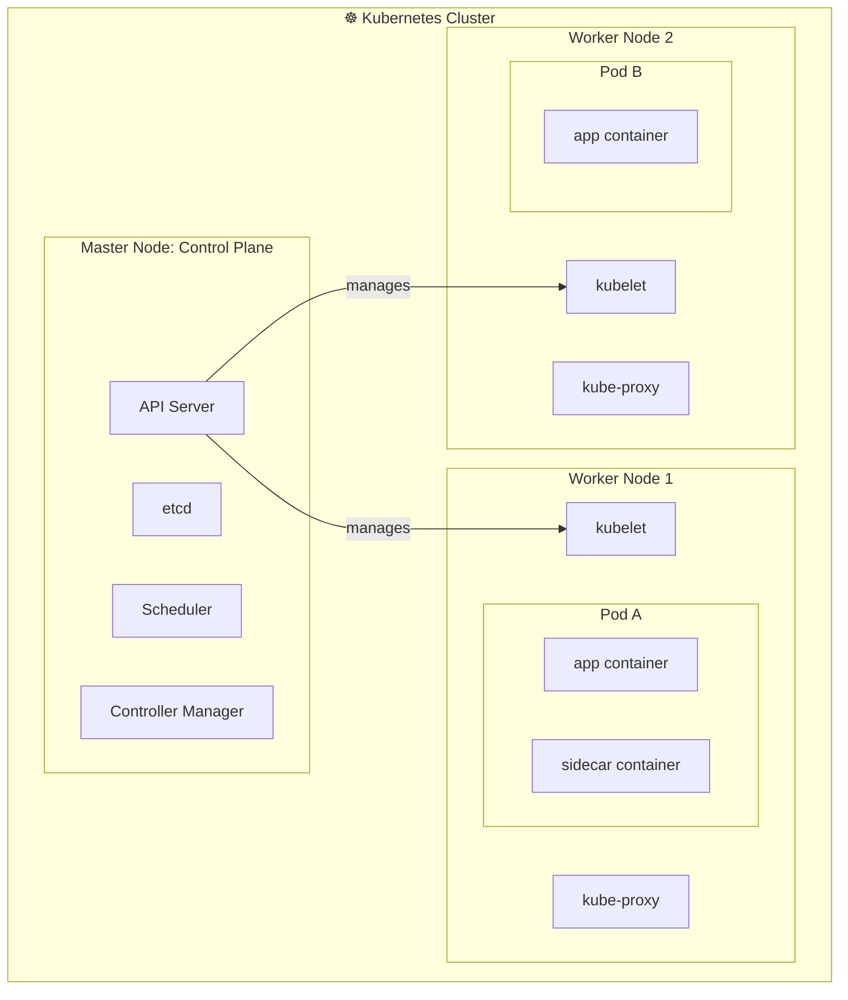

# Cluster Components

> Cluster-level concepts (Node, Master/Worker): [Cluster](Cluster.md)

## 1. API Server
The **API Server** acts as the front end for Kubernetes. Users, management devices, and command-line interfaces (CLIs) interact with it to manage the cluster.

## 2. etcd
**etcd** is a distributed key-value store used by Kubernetes to store all cluster data. It maintains information across multiple nodes and masters, implementing locks to ensure there are no configuration conflicts between master components.

## 3. kubelet
The **kubelet** is an agent that runs on each node in the cluster. It is responsible for ensuring that containers are running as expected within their [pods](Pods.md).

## 4. Container Runtime
The **Container Runtime** is the underlying software responsible for managing container lifecycle on a node: pulling images from a registry, creating and starting containers, and stopping or removing them when no longer needed. Common runtimes include **containerd** (the most widely used) and **CRI-O**. The kubelet communicates with the container runtime through a standardized interface called the **Container Runtime Interface (CRI)**, which decouples Kubernetes from any specific runtime implementation.

## 5. Controller
The **Controller** is the "brain" behind orchestration. It monitors nodes and containers, making decisions to bring up new [pod](Pods.md) instances if the current state deviates from the desired state (e.g., if a node or container goes down).

## 6. Scheduler
The **Scheduler** is responsible for distributing workloads and [pods](Pods.md) across multiple nodes, ensuring efficient resource utilization and adherence to placement constraints.

---

## Overall Structure

---

→ [kubernetes.io: Components](https://kubernetes.io/docs/concepts/overview/components/)

← [Kubernetes](300%20-%20Containers/Kubernetes/README.md)
