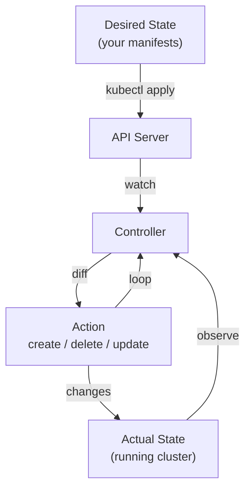

# Kubernetes Concepts

## Imperative vs Declarative

| | Imperative | Declarative |
|---|---|---|
| **How** | Tell K8s *what to do* | Tell K8s *desired state* |
| **Commands** | `create`, `delete`, `scale`, `set image` | `apply`, `diff` |
| **Idempotent** | No — fails if object exists | Yes — create or update |
| **GitOps** | Poor fit | Native fit |

**Imperative** — you manage the sequence. Good for quick one-offs, debugging, bootstrapping.

**Declarative** — you describe the end state; K8s figures out how to get there. `kubectl apply` computes a **3-way diff**:

```
last-applied annotation  ←→  live state  ←→  new manifest
```

This lets `apply` know which fields *you* removed (delete them) vs which controllers added (leave alone). See [[kubectl#--save-config and the last-applied annotation|kubectl]] for the annotation detail.

---

## Reconciliation Loop

The engine behind declarative management. Kubernetes controllers continuously watch the cluster and reconcile actual state toward desired state.



This is why declarative works: you don't have to script every step. You declare what you want, and controllers keep reality aligned with it — even if pods crash, nodes go down, or someone edits the live state manually.

The [[Components#5. Controller|Controller Manager]] on the master node runs these control loops. Each controller is responsible for one resource type (Deployment controller, ReplicaSet controller, etc.).

---

## Labels and Selectors

Labels are key-value pairs attached to any Kubernetes object. Selectors filter objects by their labels. This is the primary mechanism Kubernetes uses to connect resources to each other.

```yaml
metadata:
  labels:
    app: nginx
    env: prod
    tier: frontend
```

### Selector types

**Equality-based** — used by ReplicationController and older APIs:
```yaml
selector:
  app: nginx          # matches pods where app == "nginx" exactly
```

**Set-based** — used by ReplicaSet, Deployment, Service, NetworkPolicy:
```yaml
selector:
  matchLabels:
    app: nginx                        # shorthand equality
  matchExpressions:
    - key: env
      operator: In
      values: [staging, prod]         # env must be "staging" OR "prod"
    - key: tier
      operator: NotIn
      values: [database]              # tier must NOT be "database"
    - key: version
      operator: Exists                # "version" key must exist, any value
```

### Why labels matter across resources

- **ReplicaSet/Deployment** uses selectors to know which pods it owns — see [[Controllers#ReplicaSet|Controllers]]
- **Services** use selectors to route traffic to the right pods
- **NetworkPolicies** use selectors to scope firewall rules
- Rolling updates rely on labels to track pods across old and new ReplicaSets

A mismatch between a controller's selector and a pod's labels means the controller ignores that pod — a common source of bugs.

---

→ [kubernetes.io — Declarative Management](https://kubernetes.io/docs/tasks/manage-kubernetes-objects/declarative-config/)
→ [kubernetes.io — Imperative Management](https://kubernetes.io/docs/tasks/manage-kubernetes-objects/imperative-command/)
→ [kubernetes.io — Labels and Selectors](https://kubernetes.io/docs/concepts/overview/working-with-objects/labels/)

← [[300 - Containers/Kubernetes/README|Kubernetes]]