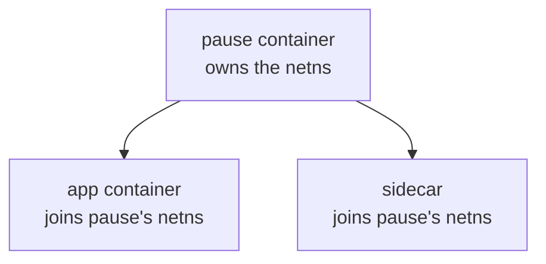
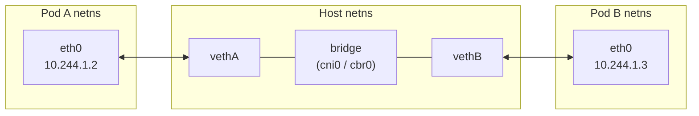
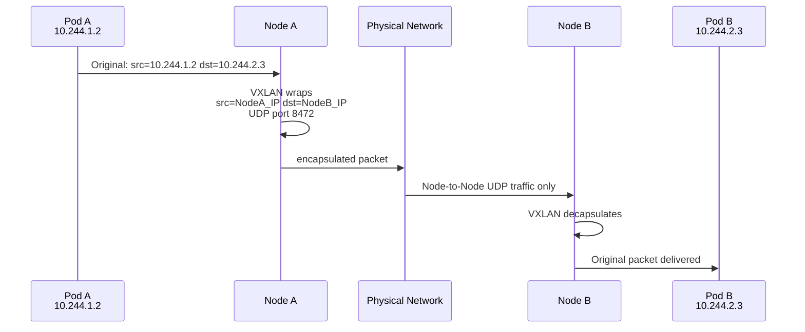
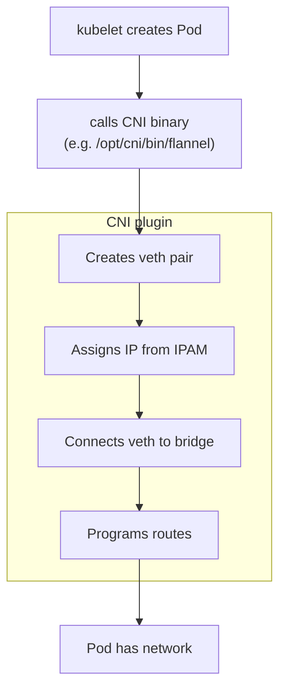
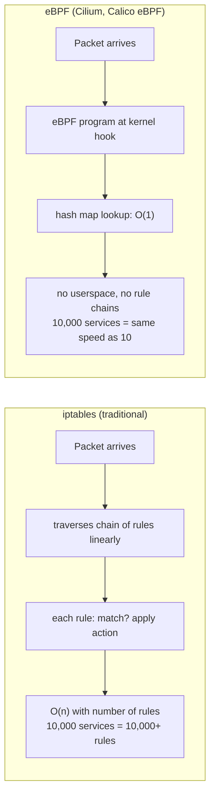
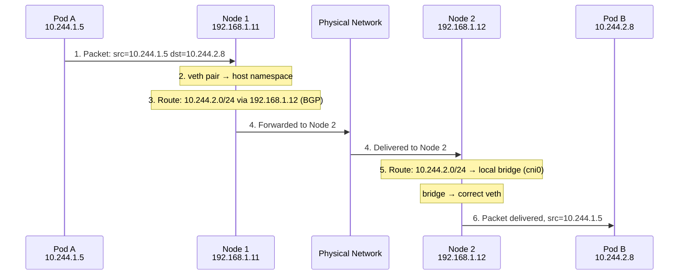
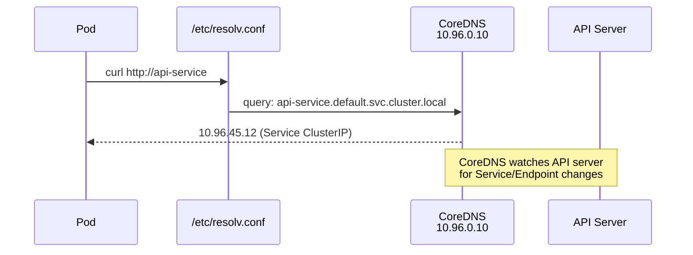

# Kubernetes Networking

Problem: Pod on Node A must reach Pod on Node B as if same LAN. OS knows nothing about Pods — network layer builds it.

## Network Namespaces

Each Pod = own Linux netns (own interfaces, routes, iptables). Containers in same Pod share one netns → talk via `localhost`, can't bind same port.

```
Node
├── Host netns (eth0, lo)
├── Pod A netns (eth0 @ 10.244.1.2)
├── Pod B netns (eth0 @ 10.244.1.3)
└── Pod C netns (eth0 @ 10.244.1.4)
```

**pause container**: hidden infra/sandbox container. Holds netns open so Pod IP stays stable when app containers restart. App + sidecars join its netns.



## Intra-Node

Pod netns ↔ host via **veth pair** (virtual cable). Host ends plug into Linux **bridge** (`cni0`/`cbr0`) = virtual switch. Same-node traffic never leaves host.



## Inter-Node

Two approaches.

### Overlay (Encapsulation) — VXLAN

Wrap Pod packet in Node-to-Node UDP. Physical net sees only Node IPs.



Works anywhere. Cost: ~50B header + CPU.

### Native Routing (No Overlay)

Each node owns Pod CIDR; program routes so traffic to that CIDR goes to that node IP.

```
Node A routes:
  10.244.1.0/24  via local bridge
  10.244.2.0/24  via 192.168.1.11  (Node B)
  10.244.3.0/24  via 192.168.1.12  (Node C)
```

Faster, no encap. Needs physical net to know routes — easy in cloud VPC, needs BGP on bare metal.

## CNI

Spec: binary kubelet calls on Pod start/stop. Must assign IP, set up interfaces, program routes.



**IPAM** — hands out IPs:

| Plugin | How |
|---|---|
| `host-local` | Per-node fixed subnet |
| `dhcp` | DHCP server |
| `calico-ipam` | Calico block allocator |
| `whereabouts` | Cluster-wide (multus) |

## CNI Plugins

**Flannel** — simplest. VXLAN default, host-gw if L2 adjacent. No NetworkPolicy.

**Calico** — production standard. BGP native routing (fallback VXLAN/IP-in-IP). Full NetworkPolicy + CRD. WireGuard encryption. eBPF dataplane optional.

**Cilium** — eBPF-native. Replaces iptables + kube-proxy. L3/L4/L7 policy (HTTP, gRPC). Hubble observability. ClusterMesh. Needs kernel 5.10+.

**Weave** — VXLAN, auto peer discovery, encryption. Mostly legacy.

**Multus** — meta-plugin. Attach Pod to multiple networks (telco/NFV).

```yaml
annotations:
  k8s.v1.cni.cncf.io/networks: sriov-net, macvlan-net
```

## eBPF vs iptables



eBPF: JIT-compiled, kernel-verified, kernel-space. At scale: big latency + CPU win.

## Cross-Node Packet Walk (Calico+BGP)



No NAT. Real Pod IPs end-to-end = flat network model.

## DNS



CoreDNS watches API server for Service/Endpoint changes. Forwards external names.

Pod `/etc/resolv.conf`:

```
search default.svc.cluster.local svc.cluster.local cluster.local
nameserver 10.96.0.10
```

Bare `curl api-service` auto-expands to FQDN.

## Mental Models

| Concept | = |
|---|---|
| Network namespace | Pod's isolated network stack |
| veth pair | Patch cable Pod ↔ host |
| Linux bridge | Virtual switch on node |
| CNI plugin | Contractor wiring it up |
| VXLAN overlay | Tunnel through physical net |
| BGP | Teach routers where Pod subnets live |
| eBPF | Kernel programs, O(1) packet decisions |

← [[300 - Containers/Kubernetes/README|Kubernetes]] | [[Kubernetes MOC]]
