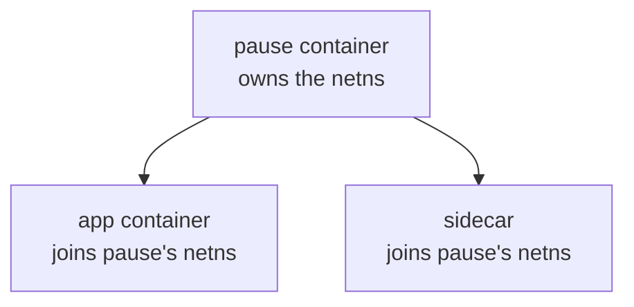
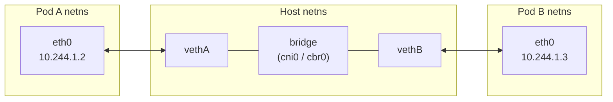
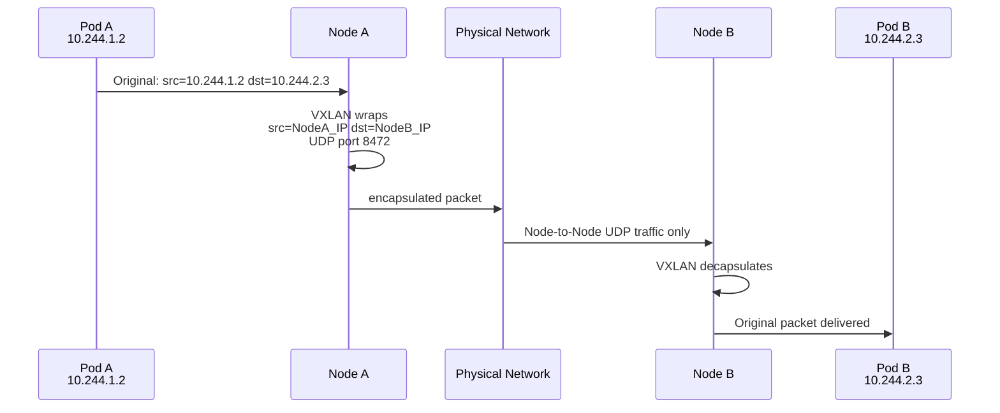
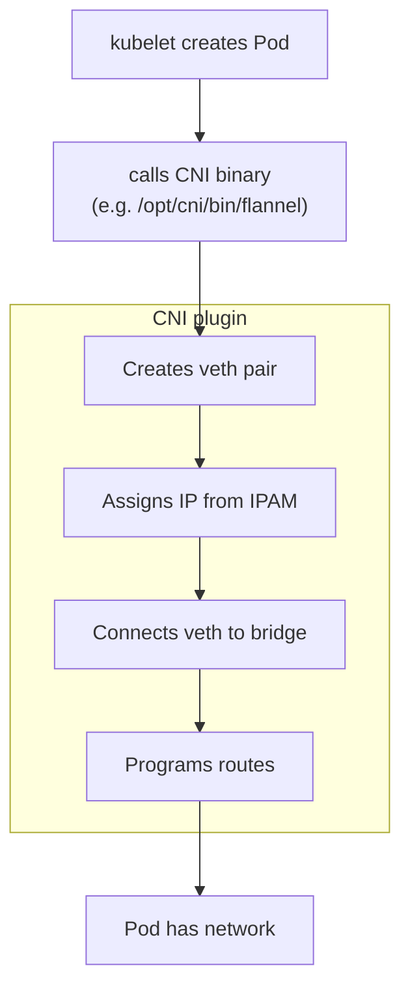
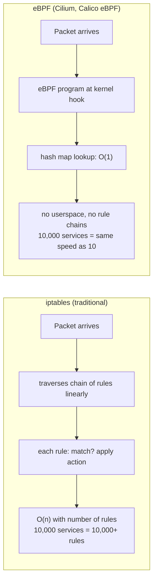
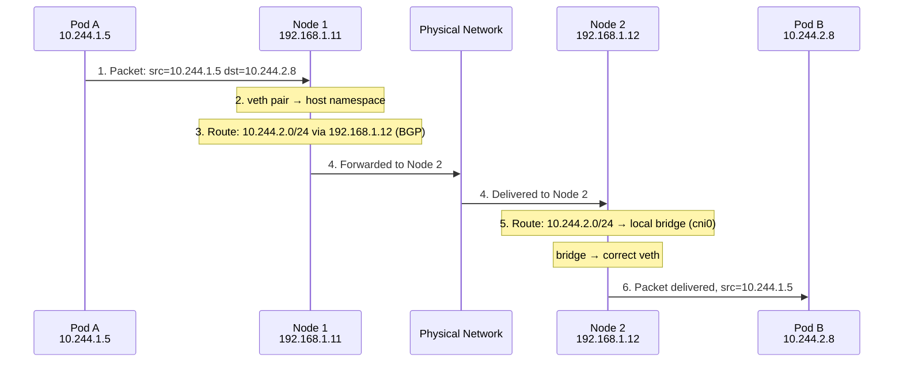
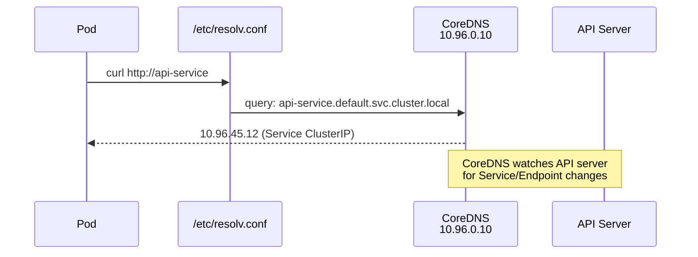

# Kubernetes Networking — Deep Dive

## The Networking Problem K8s Has to Solve

When you run containers across multiple nodes, you face a fundamental challenge: how does a container on **Node A** talk to a container on **Node B** as if they're on the same LAN?

The OS has no idea about Pods. You have to build this yourself — and that's what the network layer does.

---

## The Network Namespaces Foundation

This is all Linux under the hood.

Every Pod lives in its own **network namespace** — an isolated copy of the network stack with its own interfaces, routing table, and iptables rules.

```
Node
├── Host network namespace (eth0, lo, ...)
├── Pod A namespace (eth0 @ 10.244.1.2, lo)
├── Pod B namespace (eth0 @ 10.244.1.3, lo)
└── Pod C namespace (eth0 @ 10.244.1.4, lo)
```

Containers _within_ the same Pod share one namespace — that's why they communicate via `localhost` and must not bind the same port.

### The pause Container

Every Pod has a hidden container called **pause** (a.k.a. the _infra_ or _sandbox_ container). It does nothing except hold the network namespace open. All app containers in the Pod attach to it. This way, if your app container crashes and restarts, the network namespace (and Pod IP) stays stable.



---

## Intra-Node Communication

How do two Pods on the **same node** talk?

Each Pod namespace connects to the host via a **veth pair** — a virtual ethernet cable with one end in the Pod namespace and the other in the host namespace.



All veth host-ends plug into a **Linux bridge** (usually `cni0` or `cbr0`). The bridge acts like a virtual switch — it learns MACs and forwards frames between veth pairs. Pod-to-Pod traffic on the same node never leaves the host.

---

## Inter-Node Communication — The Real Challenge

This is where CNI plugins do their heavy lifting. There are two fundamental approaches:

### Approach 1 — Overlay Networks (Encapsulation)

Wrap the Pod-to-Pod packet inside another packet that the physical network _does_ understand.

**VXLAN** is the most common:



The physical network only sees Node-to-Node UDP traffic. It doesn't need to know anything about Pod IPs. This works anywhere — bare metal, cloud, on-prem — as long as nodes can reach each other.

**Drawback:** encapsulation overhead, extra CPU, ~50 bytes of header per packet.

---

### Approach 2 — Native/Direct Routing (No Overlay)

Skip encapsulation entirely. Tell the physical network how to reach each Pod CIDR.

Each node owns a Pod subnet (e.g. Node A owns `10.244.1.0/24`). You program routes so that traffic destined for `10.244.2.0/24` goes directly to Node B's IP.

```
Node A routing table:
  10.244.1.0/24  via local bridge (own pods)
  10.244.2.0/24  via 192.168.1.11  (Node B)
  10.244.3.0/24  via 192.168.1.12  (Node C)
```

**No encapsulation.** Packets travel natively. Much faster.

**Drawback:** your physical network/router must know these routes. Works easily in clouds with VPC route tables (AWS, GCP), harder on bare metal unless you use BGP.

---

## CNI — Container Network Interface

CNI is just a **spec + convention**. It defines:

- A binary that kubelet calls when a Pod starts/stops
- What JSON config that binary reads
- What it must do: assign IP, set up interfaces, program routes



### IPAM — IP Address Management

A sub-component of CNI responsible for handing out IPs. Common backends:

| IPAM Plugin   | How it works                                        |
| ------------- | --------------------------------------------------- |
| `host-local`  | Each node allocates from its own fixed subnet range |
| `dhcp`        | Calls out to a DHCP server                          |
| `calico-ipam` | Calico's own block-based allocator                  |
| `whereabouts` | Cluster-wide IP range tracking (good for multus)    |

---

## Major CNI Plugins Compared

### Flannel

The simplest option. Pure Layer 3 overlay.

- Default backend: **VXLAN**
- Can also do host-gw (direct routing, no overlay) if nodes are L2 adjacent
- No NetworkPolicy support — needs Calico on top for that
- Very low operational complexity
- Good for: learning, small clusters, simple setups

### Calico

The most widely used in production.

- Default: **no overlay** — uses BGP to distribute routes natively
- Can fall back to VXLAN/IP-in-IP if BGP isn't possible
- Full **NetworkPolicy** support + its own extended `NetworkPolicy` CRD
- Built-in **WireGuard** encryption between nodes
- eBPF dataplane available (bypasses iptables entirely)
- Good for: production, anything needing policy enforcement

### Cilium

The modern, eBPF-native option.

- Replaces iptables with **eBPF programs** loaded directly into the kernel
- Operates at L3/L4/L7 — can enforce policy based on HTTP methods, paths, gRPC calls
- Built-in **Hubble** for deep network observability (flow logs per connection)
- Supports **ClusterMesh** — connect multiple K8s clusters at the network level
- Replaces kube-proxy entirely with eBPF
- Higher operational complexity, requires newer kernels (5.10+)
- Good for: large-scale production, observability-heavy environments, multi-cluster

### Weave

- VXLAN-based overlay
- Automatic peer discovery (no etcd dependency for topology)
- Built-in encryption
- Mostly legacy now — less common in new deployments

### Multus

Not a standalone CNI — a **meta-plugin** that lets a Pod attach to _multiple_ networks.

```yaml
annotations:
  k8s.v1.cni.cncf.io/networks: sriov-net, macvlan-net
```

Used heavily in telco/NFV workloads where Pods need a management network + a high-speed data plane network simultaneously.

---

## eBPF vs iptables Dataplane

This is worth understanding because it's the direction the ecosystem is heading.



eBPF programs are JIT-compiled, verified for safety by the kernel, and run in kernel space. At scale the performance difference is dramatic — both in latency and CPU overhead.

---

## Cross-Node Packet Walk (End to End)

Let's trace a packet from Pod A on Node 1 to Pod B on Node 2 using **Calico with BGP**:



No NAT anywhere. Pod A sees its real IP as source. Pod B sees Pod A's real IP. That's the flat network model in action.

---

## DNS Resolution Path

When a Pod does `curl http://api-service`:



CoreDNS watches the API server for Service/Endpoint changes and keeps its records live. It also handles external DNS forwarding for names it doesn't recognize.

The search domains in `/etc/resolv.conf` inside a Pod look like:

```
search default.svc.cluster.local svc.cluster.local cluster.local
nameserver 10.96.0.10
```

So a bare `curl api-service` automatically expands to the full FQDN.

---

## Key Mental Models

|Concept|Think of it as|
|---|---|
|Network namespace|A VM's isolated network stack, but for a Pod|
|veth pair|A patch cable between Pod and host|
|Linux bridge|A virtual switch on the node|
|CNI plugin|The contractor that wires everything up|
|VXLAN overlay|A tunnel through the physical network|
|BGP routing|Teaching routers where each Pod subnet lives|
|eBPF|Tiny programs running in the kernel for O(1) packet decisions|

← [[300 - Containers/Kubernetes/README|Kubernetes]] | [[Kubernetes MOC]]