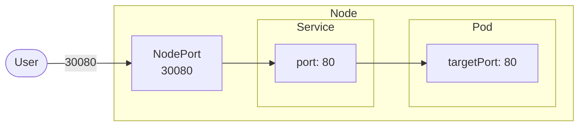

# Services

A Service connects applications to other applications or users. It decouples frontend from backend, enabling loose coupling between microservices.

Without a Service, Pods are ephemeral; their IPs change when they restart. A Service provides a **stable endpoint** (IP + DNS name) that routes traffic to the right Pods, regardless of how many come and go.

---

## Service Types

| Type | Access scope | Use case |
|------|-------------|----------|
| **ClusterIP** | Internal only (within cluster) | Frontend talking to backend inside the cluster |
| **NodePort** | External (via node IP + port) | Quick external access, dev/testing |
| **LoadBalancer** | External (via cloud LB) | Production external access |

---

## ClusterIP

Creates a **virtual IP** inside the cluster. The Service is reachable only from within the cluster. This is the **default** type when you don't specify one.

```yaml
apiVersion: v1
kind: Service
metadata:
  name: backend-service
spec:
  type: ClusterIP
  ports:
    - port: 80
      targetPort: 8080
  selector:
    app: backend
```

Any Pod in the cluster can reach this Service at `backend-service.default.svc.cluster.local:80` (or just `backend-service:80` within the same namespace). See [[300 - Containers/Kubernetes/Networking#DNS Resolution Path|Networking: DNS]].

---

## NodePort

Exposes the Service on a **port on every node** in the cluster. External traffic can reach the Service by hitting `<NodeIP>:<NodePort>`.

The NodePort range is **30000-32767**.

```yaml
apiVersion: v1
kind: Service
metadata:
  name: app-service
spec:
  type: NodePort
  ports:
    - targetPort: 80
      port: 80
      nodePort: 30080
  selector:
    app: my-app
    type: front-end
```

### Port Fields



| Field | Purpose | Required |
|-------|---------|----------|
| `port` | Service port (what other Pods/Services use) | Yes |
| `targetPort` | Port on the Pod the traffic forwards to | No (defaults to `port`) |
| `nodePort` | Port on the node for external access | No (auto-assigned from 30000-32767) |

---

## Selectors: Routing Traffic to Pods

The `selector` field matches Pod **labels**. The Service routes traffic only to Pods that match **all** specified labels.

```yaml
spec:
  selector:
    app: my-app
    type: front-end
```

This Service sends traffic to Pods that have **both** `app: my-app` AND `type: front-end`:

```yaml
apiVersion: v1
kind: Pod
metadata:
  name: my-pod
  labels:
    app: my-app
    type: front-end
spec:
  containers:
    - name: my-container
      image: nginx
```

Selectors work the same way as in [[Controllers#ReplicaSet|ReplicaSet selectors]], using `matchLabels` under the hood.

---

## LoadBalancer

Provisions a **cloud load balancer** (AWS ALB/NLB, GCP LB, etc.) that distributes external traffic across the Service's Pods. The cloud provider handles the LB lifecycle.

```yaml
apiVersion: v1
kind: Service
metadata:
  name: app-service
spec:
  type: LoadBalancer
  ports:
    - port: 80
      targetPort: 80
  selector:
    app: my-app
```

In production, you typically use an Ingress instead of a LoadBalancer Service per application, since Ingress can route multiple hostnames/paths through a single LB.

---

← [[300 - Containers/Kubernetes/README|Kubernetes]] | [[Kubernetes MOC]]
