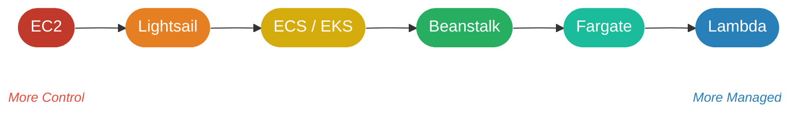

# Compute

## EC2 — Elastic Compute Cloud

EC2 is AWS's core compute service. Provides **virtual machines (instances)** running on AWS-managed physical hardware.

### Multi-Tenancy

Instances run on **shared physical hardware** but are fully isolated — this model is called **multi-tenancy**. AWS's hypervisor enforces isolation so one tenant cannot access another's data or resources.

### Elasticity (Scaling)

EC2 instances are resizable; pay only for what you use, adjust capacity any time:

| Direction | Action | When to use |
|-----------|--------|-------------|
| Scale **up** | Increase instance size (more CPU/RAM) | Single workload needs more power |
| Scale **down** | Decrease instance size | Over-provisioned; reduce cost |
| Scale **out** | Add more instances (horizontal) | Distribute load across many instances |
| Scale **in** | Remove instances | Demand has dropped |

### Auto Scaling

Automates the scale-out / scale-in process. You define a group of EC2 instances; Auto Scaling adjusts the count based on demand — no manual intervention.

**Three capacity settings per group:**

| Setting | Meaning |
|---------|---------|
| **Minimum** | Floor — never drop below this count |
| **Desired** | Target count when no scaling event is active |
| **Maximum** | Ceiling — never exceed this count |

**Scaling policies:**

- **Target tracking** — maintain a metric at a target value (e.g. keep average CPU at 50%). Simplest to configure.
- **Step scaling** — add/remove a fixed number of instances when a CloudWatch alarm threshold is crossed.
- **Scheduled** — scale at a known time (e.g. add capacity every weekday at 08:00).

**Example:** An e-commerce site sets minimum=2, desired=4, maximum=10. Scale-in policy: "if CPU < 20% for 5 minutes, remove 1 instance."

| Time | Event | Instances |
|------|-------|-----------|
| 02:00 AM | Traffic almost zero, CPU drops to 8% | 4 |
| 02:05 AM | CPU < 20% for 5 min → scale-in fires | 3 |
| 02:10 AM | Still low → fires again | 2 |
| 02:15 AM | Still low → policy wants to fire again | 2 — minimum blocks it |

At 02:15 the policy would remove another instance, but desired can't go below minimum=2, so it stops.

Pairs with **Elastic Load Balancing (ELB)** — new instances register with the load balancer automatically; terminated instances deregister before shutdown.

> Auto Scaling is free — you pay only for the EC2 instances it manages.

---

## Cloud vs. On-Premises

| Benefit | Cloud (AWS) | On-Premises |
|---------|-------------|-------------|
| Upfront cost | None — pay-as-you-go | Large capital expenditure for hardware |
| Provisioning speed | Seconds to minutes | Weeks to months (procurement + setup) |
| Hardware management | AWS-managed | Your team's responsibility |

---

## Other Compute Services

### AWS Lambda

**Serverless compute** — run code without provisioning or managing servers. Pay only for compute time consumed.

- Upload your function code; Lambda handles everything else (scaling, availability, patching)
- Triggered by events (HTTP requests via API Gateway, S3 uploads, DynamoDB changes, etc.)
- **Max execution duration: 15 minutes** per invocation — not suited for long-running processes

**Cold starts** — on the first invocation (or after a period of idle), Lambda must initialize a new execution environment (download code, start runtime). This adds latency. Mitigation: **Provisioned Concurrency** keeps a set number of environments pre-warmed and ready.

**Concurrency** — each simultaneous invocation runs in its own isolated environment. Default soft limit: **1,000 concurrent executions per [[Global Infrastructure#Regions|region]]** (can be raised via support request).

**Pricing** — charged on two dimensions:
- **Requests:** first 1 M requests/month free; $0.20 per 1 M requests after
- **Duration:** billed in GB-seconds (memory allocated × execution time); 400,000 GB-seconds/month free

**When Lambda is unsuitable:**

| Scenario | Reason |
|----------|--------|
| Workloads > 15 min | Hard execution limit |
| Persistent connections (e.g., WebSockets, long-poll DB) | Environment torn down after each invocation |
| Stateful applications requiring in-memory state across calls | Each invocation is isolated; no shared state |

### Elastic Beanstalk

Fully managed PaaS. Deploy and scale web applications without managing infrastructure. You provide the code; Beanstalk handles capacity, load balancing, and health monitoring.

### AWS Batch

Fully managed service for large-scale **batch computing jobs**. Dynamically provisions the optimal compute resources based on job requirements.

### Amazon Lightsail

Simplified cloud platform offering VPS, containers, and databases with **predictable pricing**. Designed for simpler workloads and developers new to AWS.

### AWS Outposts

Extends AWS infrastructure and services to **on-premises locations** for low-latency or local data processing requirements. See also: [[Global Infrastructure#Outposts]].

---

## Compute Services — Comparison

| Service | Control | Servers to manage | Best for | Pricing model |
|---------|---------|-------------------|----------|---------------|
| **EC2** | Full (OS, runtime, config) | Yes | Custom workloads, long-running, full control | Per-second (min 60 s) |
| **Elastic Beanstalk** | App code only | No (AWS manages infra) | Web apps/APIs, skip infra setup | No extra cost — pay for underlying EC2/RDS |
| **Lambda** | Function code only | No — fully serverless | Event-driven, short tasks (≤15 min), spiky traffic | Per-request + GB-second |
| **[[Containers#Amazon ECS\|ECS]] / [[Containers#Amazon EKS\|EKS]]** | Container definition | Depends on launch type | Containerized microservices, long-running containers | EC2 launch: pay instances; Fargate: pay vCPU+mem |
| **[[Containers#AWS Fargate\|AWS Fargate]]** | Container code only | No — serverless containers | Containers without managing EC2 clusters | Per vCPU-second + GB-second |
| **AWS Batch** | Job definition | No | Large-scale batch jobs, HPC, data pipelines | Pay for underlying compute only while jobs run |
| **Lightsail** | Full (simplified VPS) | Yes (abstracted) | Simple apps, fixed budget, AWS beginners | Fixed monthly price |
| **Outposts** | Full (on-prem) | Yes — physical rack | Low-latency workloads that must stay on-premises | Hardware lease + AWS service fees |

### Key Decision Questions

```
Need full OS control?          → EC2
Event-driven / short burst?    → Lambda
Web app, skip infra entirely?  → Elastic Beanstalk
Containers, no cluster mgmt?   → Fargate (or ECS/EKS on Fargate)
Batch / HPC jobs?              → AWS Batch
Simple app, fixed budget?      → Lightsail
Must stay on-prem?             → Outposts
```

### Control vs. Convenience Spectrum



---

← [[AWS/Cloud Practitioner/Index]] · [[Home]]
