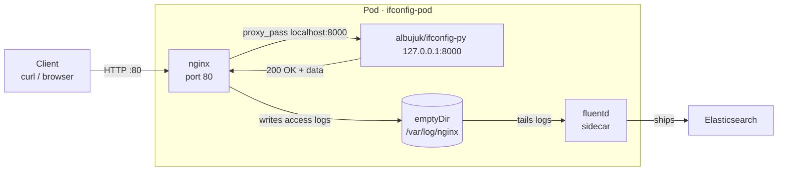
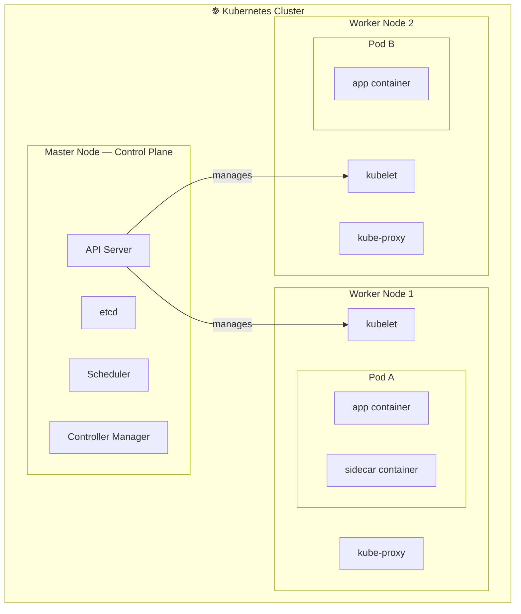

# Kubernetes Introduction

## Node
A **Node** is a physical or virtual machine with Kubernetes installed. Nodes serve as the worker machines in a cluster and are sometimes referred to as "minions."

## Cluster
A **Cluster** is a collection of nodes grouped together. Distributing workloads across multiple nodes ensures high availability and efficient load balancing.

## Master Node
The **Master Node** is a specialized node responsible for managing and orchestrating the other nodes within the cluster, ensuring the desired state of the system is maintained.

## Master vs. Worker Nodes

| Feature                | Master Node (Control Plane)                                                | Worker Node (Data Plane)                                           |
| :--------------------- | :------------------------------------------------------------------------- | :----------------------------------------------------------------- |
| **Role**               | Management & Orchestration                                                 | Execution & Workload                                               |
| **Responsibility**     | Maintaining desired state, scheduling, and cluster-wide decisions.         | Running application containers and managing local networking.      |
| **Primary Components** | API Server, etcd, Scheduler, Controller Manager, Cloud Controller Manager. | Kubelet, Kube-proxy, Container Runtime (e.g., Docker, containerd). |
| **Count**              | 1 (Single) or 3+ (High Availability).                                      | 1 to many (Scalable).                                              |

---

# Kubernetes Components

## 1. API Server
The **API Server** acts as the front end for Kubernetes. Users, management devices, and command-line interfaces (CLIs) interact with it to manage the cluster.

## 2. etcd
**etcd** is a distributed key-value store used by Kubernetes to store all cluster data. It maintains information across multiple nodes and masters, implementing locks to ensure there are no configuration conflicts between master components.

## 3. kubelet
The **kubelet** is an agent that runs on each node in the cluster. It is responsible for ensuring that containers are running as expected within their pods.

## 4. Container Runtime
The **Container Runtime** is the underlying software used to run containers. It handles the actual execution of containerized applications on the nodes.

## 5. Controller
The **Controller** is the "brain" behind orchestration. It monitors nodes and containers, making decisions to bring up new instances if the current state deviates from the desired state (e.g., if a node or container goes down).

## 6. Scheduler
The **Scheduler** is responsible for distributing workloads and containers across multiple nodes, ensuring efficient resource utilization and adherence to placement constraints.


---

## Pod
A **Pod** is the smallest deployable unit in Kubernetes — a wrapper around one or more containers that share the same network namespace and storage. Every container in Kubernetes runs inside a Pod.

- Each Pod gets its own internal IP address within the cluster.
- Pods are ephemeral: if they die, Kubernetes spins up a new one (with a new IP).
- Kubernetes scales by adding/removing Pods, not containers directly.

### Multi-Container Pods
A Pod *can* hold multiple containers, but they must be **different types/images** — not duplicates of the same app. Common pattern: a main app container + a helper (sidecar) container (e.g., a log shipper, proxy, or config reloader). They share localhost and volumes.

### Sidecar Example — Log Shipper

Your app writes logs to a file. The sidecar picks them up and ships to a log aggregator. App knows nothing about shipping — it just writes.

App used: **albujuk/ifconfig-py** — lightweight Python web service (like ifconfig.me) that returns client IP and metadata. Runs on port `8000`, exposes `/ip`, `/ua`, `/json`, `/health`, etc.

Setup: `ifconfig-py` sits behind **nginx** (reverse proxy on port 80). nginx forwards requests to `localhost:8000`. A **fluentd** sidecar ships nginx access logs to Elasticsearch. All three share the same Pod — same localhost, same volumes.

```
Pod
├── ifconfig-py   (albujuk/ifconfig-py, :8000)  ← actual app
├── nginx         (nginx, :80)                  ← reverse proxy → localhost:8000
└── fluentd       (fluentd)                     ← reads nginx logs, ships to ES
         ↑
     shared volume (emptyDir) — nginx writes logs, fluentd reads them
```

```yaml
apiVersion: v1
kind: Pod
metadata:
  name: ifconfig-pod
spec:
  containers:
    - name: ifconfig
      image: albujuk/ifconfig-py
      env:
        - name: PORT
          value: "8000"
        - name: HOST
          value: "127.0.0.1"      # only reachable inside the Pod (nginx handles outside traffic)

    - name: nginx
      image: nginx
      ports:
        - containerPort: 80
      volumeMounts:
        - name: nginx-config
          mountPath: /etc/nginx/conf.d
        - name: logs
          mountPath: /var/log/nginx

    - name: log-shipper           # sidecar — different image, different job
      image: fluentd
      volumeMounts:
        - name: logs
          mountPath: /var/log/nginx   # same volume → reads what nginx wrote

  volumes:
    - name: logs
      emptyDir: {}                # shared scratch space, lives as long as the Pod
    - name: nginx-config
      configMap:
        name: nginx-ifconfig-conf  # configMap proxying / → localhost:8000
```

`emptyDir` is created when Pod starts, deleted when Pod dies. Both containers see the same files through it.



---

## Overall Structure

