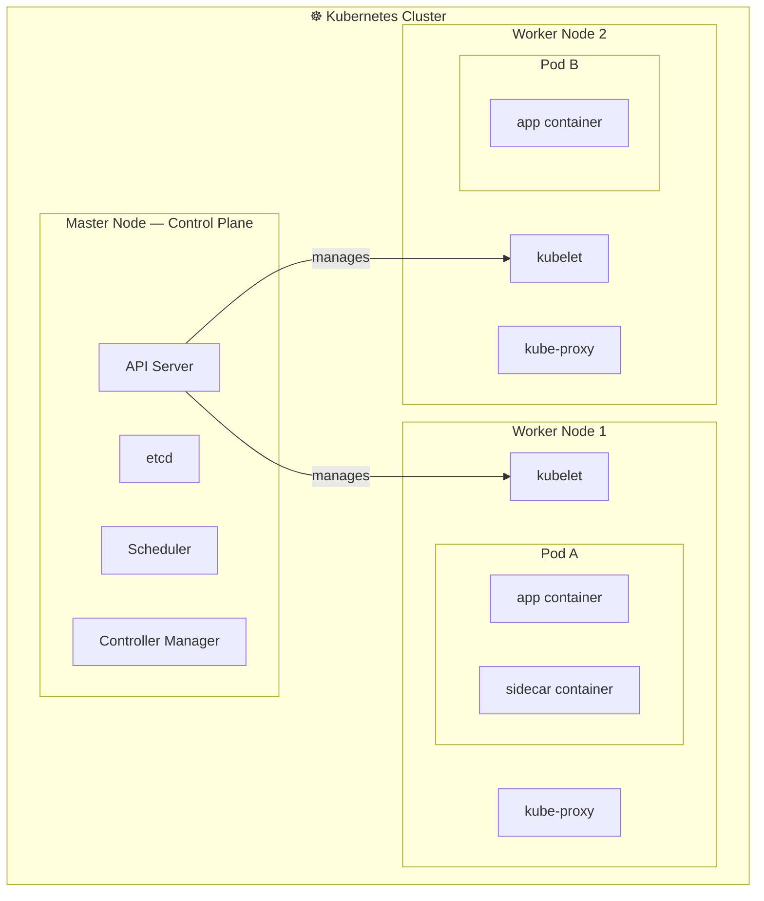

# Kubernetes Introduction

## Node
A **Node** is a physical or virtual machine with Kubernetes installed. Nodes serve as the worker machines in a cluster and are sometimes referred to as "minions."

## Cluster
A **Cluster** is a collection of nodes grouped together. Distributing workloads across multiple nodes ensures high availability and efficient load balancing.

## Master Node
The **Master Node** is a specialized node responsible for managing and orchestrating the other nodes within the cluster, ensuring the desired state of the system is maintained.

## Master vs. Worker Nodes

| Feature                | Master Node (Control Plane)                                                | Worker Node (Data Plane)                                           |
| :--------------------- | :------------------------------------------------------------------------- | :----------------------------------------------------------------- |
| **Role**               | Management & Orchestration                                                 | Execution & Workload                                               |
| **Responsibility**     | Maintaining desired state, scheduling, and cluster-wide decisions.         | Running application containers and managing local networking.      |
| **Primary Components** | API Server, etcd, Scheduler, Controller Manager, Cloud Controller Manager. | Kubelet, Kube-proxy, Container Runtime (e.g., Docker, containerd). |
| **Count**              | 1 (Single) or 3+ (High Availability).                                      | 1 to many (Scalable).                                              |

---

# Kubernetes Components

## 1. API Server
The **API Server** acts as the front end for Kubernetes. Users, management devices, and command-line interfaces (CLIs) interact with it to manage the cluster.

## 2. etcd
**etcd** is a distributed key-value store used by Kubernetes to store all cluster data. It maintains information across multiple nodes and masters, implementing locks to ensure there are no configuration conflicts between master components.

## 3. kubelet
The **kubelet** is an agent that runs on each node in the cluster. It is responsible for ensuring that containers are running as expected within their [[Pods|pods]].

## 4. Container Runtime
The **Container Runtime** is the underlying software responsible for managing container lifecycle on a node: pulling images from a registry, creating and starting containers, and stopping or removing them when no longer needed. Common runtimes include **containerd** (the most widely used) and **CRI-O**. The kubelet communicates with the container runtime through a standardized interface called the **Container Runtime Interface (CRI)**, which decouples Kubernetes from any specific runtime implementation.

## 5. Controller
The **Controller** is the "brain" behind orchestration. It monitors nodes and containers, making decisions to bring up new [[Pods|pod]] instances if the current state deviates from the desired state (e.g., if a node or container goes down).

## 6. Scheduler
The **Scheduler** is responsible for distributing workloads and [[Pods|pods]] across multiple nodes, ensuring efficient resource utilization and adherence to placement constraints.

---

## Managed Kubernetes on AWS

AWS offers **[[AWS/Cloud Practitioner/Containers#Amazon EKS — Elastic Kubernetes Service|EKS]]** — a fully managed control plane so you don't run the master node yourself.

---

## Overall Structure

