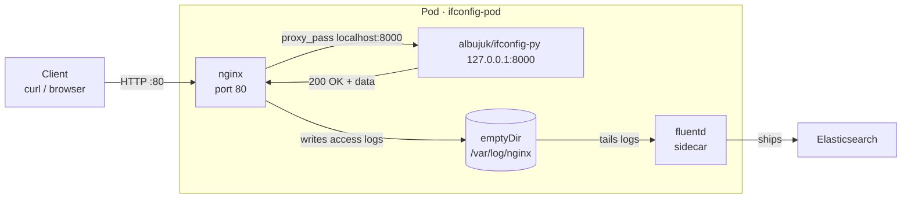

# Pods

A **Pod** is the smallest deployable unit in Kubernetes — a wrapper around one or more containers that share the same network namespace and storage. Every container in Kubernetes runs inside a Pod. Pods are managed at scale by [[Workloads|workload controllers]] (ReplicaSet, Deployment).

- Each Pod gets its own internal IP address within the cluster.
- Pods are ephemeral: if they die, Kubernetes spins up a new one (with a new IP).
- Kubernetes scales by adding/removing Pods, not containers directly.

## kubectl Commands
> Full reference: [[kubectl]]

```bash
# Create pod (imperative)
kubectl run nginx --image=nginx

# Generate YAML without creating (dry run)
kubectl run nginx --image=nginx --dry-run=client -o yaml

# Generate YAML and save to file
kubectl run nginx --image=nginx --dry-run=client -o yaml > pod.yaml

# Apply manifest
kubectl apply -f pod.yaml

# List pods
kubectl get pods
kubectl get pods -o wide          # includes node, IP

# Inspect
kubectl describe pod nginx
kubectl logs nginx

# Delete
kubectl delete pod nginx
```

---

## Multi-Container Pods
A Pod *can* hold multiple containers, but they must be **different types/images** — not duplicates of the same app. Common pattern: a main app container + a helper (sidecar) container (e.g., a log shipper, proxy, or config reloader). They share localhost and volumes.

## Sidecar Example — Log Shipper

Your app writes logs to a file. The sidecar picks them up and ships to a log aggregator. App knows nothing about shipping — it just writes.

App used: **albujuk/ifconfig-py** — lightweight Python web service (like ifconfig.me) that returns client IP and metadata. Runs on port `8000`, exposes `/ip`, `/ua`, `/json`, `/health`, etc.

Setup: `ifconfig-py` sits behind **nginx** (reverse proxy on port 80). nginx forwards requests to `localhost:8000`. A **fluentd** sidecar ships nginx access logs to Elasticsearch. All three share the same Pod — same localhost, same volumes.

```
Pod
├── ifconfig-py   (albujuk/ifconfig-py, :8000)  ← actual app
├── nginx         (nginx, :80)                  ← reverse proxy → localhost:8000
└── fluentd       (fluentd)                     ← reads nginx logs, ships to ES
         ↑
     shared volume (emptyDir) — nginx writes logs, fluentd reads them
```

```yaml
apiVersion: v1
kind: Pod
metadata:
  name: ifconfig-pod
spec:
  containers:
    - name: ifconfig
      image: albujuk/ifconfig-py
      env:
        - name: PORT
          value: "8000"
        - name: HOST
          value: "127.0.0.1"      # only reachable inside the Pod (nginx handles outside traffic)

    - name: nginx
      image: nginx
      ports:
        - containerPort: 80
      volumeMounts:
        - name: nginx-config
          mountPath: /etc/nginx/conf.d
        - name: logs
          mountPath: /var/log/nginx

    - name: log-shipper           # sidecar — different image, different job
      image: fluentd
      volumeMounts:
        - name: logs
          mountPath: /var/log/nginx   # same volume → reads what nginx wrote

  volumes:
    - name: logs
      emptyDir: {}                # shared scratch space, lives as long as the Pod
    - name: nginx-config
      configMap:
        name: nginx-ifconfig-conf  # configMap proxying / → localhost:8000
```

> ConfigMaps not yet documented — see [[Kubernetes/missing]]

`emptyDir` is created when Pod starts, deleted when Pod dies. Both containers see the same files through it.


